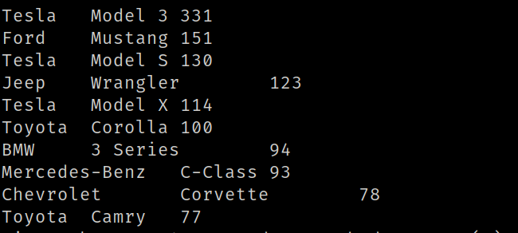

Los 10 modelos (junto con su marca) de autos más rentados (mostrar query y
visualización)

SELECT manufacturer, model, COUNT(Id) AS total_rentados
FROM car_rental_analytics
WHERE manufacturer IS NOT NULL AND model IS NOT NULL
GROUP BY manufacturer, model
ORDER BY total_rentados DESC
LIMIT 10;

