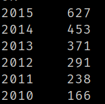

d.​ Mostrar por año, cuántos alquileres se hicieron, teniendo en cuenta automóviles
fabricados desde 2010 a 2015

SELECT year, COUNT(Id) AS total_alquileres
FROM car_rental_analytics
WHERE year BETWEEN 2010 AND 2015
GROUP BY year
ORDER BY year DESC;

